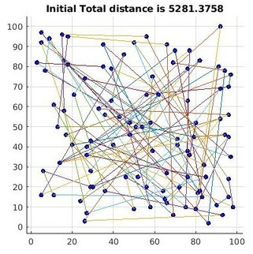
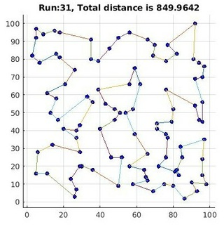

# TSP

Traveling Salesman Problem (TSP) is a well-know NP-hard 
problem formulated in early 20th century. Problem 
states that a traveling salesman wants to travel n 
islands 1) returning back to his origin and 2) not
passing through any island twice. Exhaustive search 
yields (N-1) factorial search space. So, for a 21 island 
quiestion, if we try 1 million different paths in a second
exhasutive search would roughly need 28 million years.

However, there are many optimization solutions. 
The one we use in this solution uses 2-opt with Simulated 
Annealing (SA). In 2-opt SA, the solution starts with a random
connection (connecting all islands one another and then 
connecting the last island to the first). Then, the 
algorithms chooses random 2 points and disconnects their 
edges and reassambles their edges by exchanging the edges 
between the points. Then, SA accepts the new path if it is 
shorter than the previous length. Or, it the new length is 
longer, SA accepts it with a decreasing random probability,
allowing to escape from local optima. This solution assumes
the problem as an optimization problem and finds one solution
which is good enough compared to a random solution.

## Sample run
To run this sample solution, use tsp.m. By default, 
tsp.m uses 100 islands and provides a sample solution.

 

As can be seen from the images, the total distance reduces to 
850 unit distance from 5281 unit distance.
